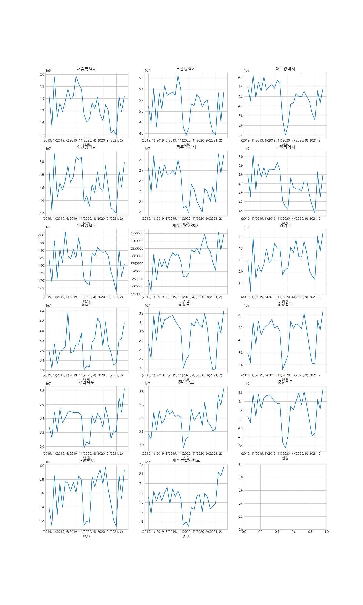
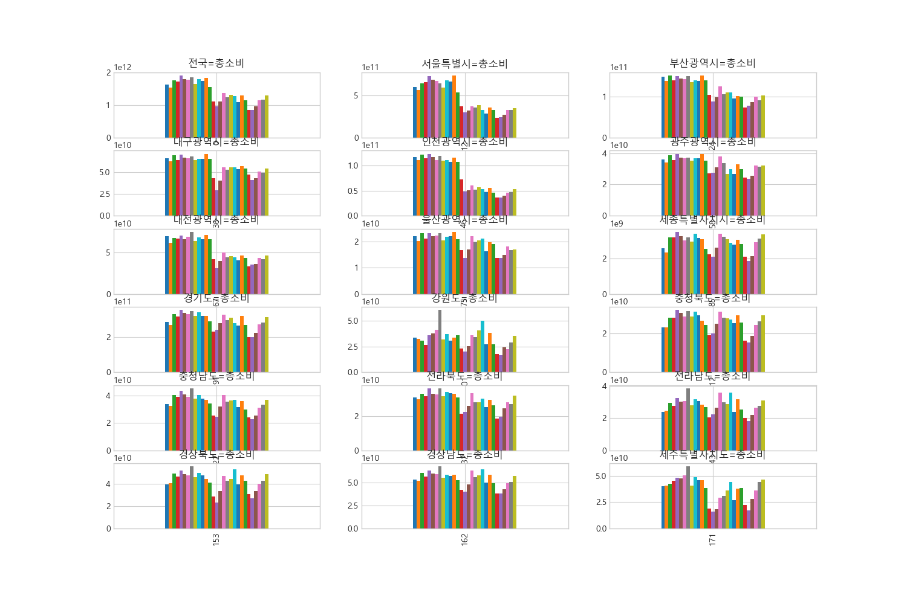

## korea tour analysis

### 사용 데이터
- 출처 : [한국관광데이터랩](https://datalab.visitkorea.or.kr/datalab/portal/main/getMainForm.do)
    - 2019-01 ~ 2021-05 까지의 월별 데이터
- 지역별 방문자수 
- 광역지자체 목적지 검색건수
- 광역지자체 관광지출액
- 광역지자체별 방문자(외지인) 거주지 데이터

### 광역지자체 - 방문자 거주지 데이터 sankey diagram

### 광역지자체 - 지역별 방문자수

### 광역지자체 - 관광지출액

### 광역지자체 - 목적지 검색 건수
